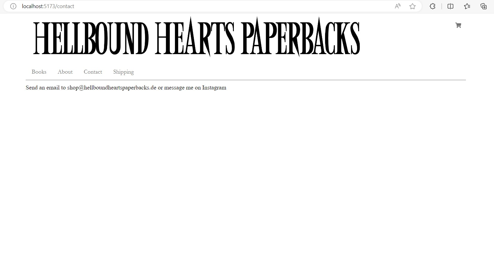
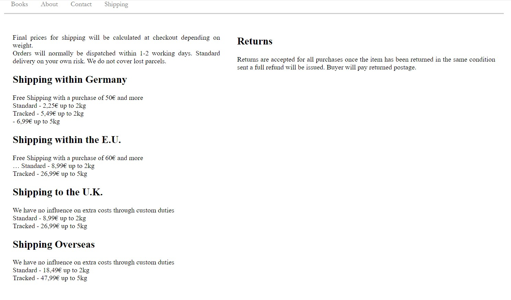
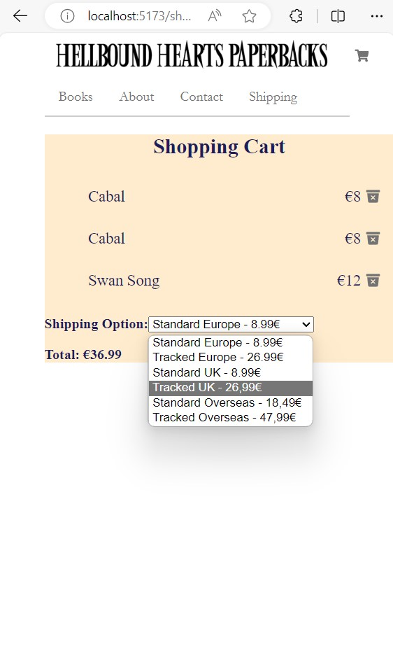

# Description

Selling website that presents several books , implements all the to do CRUD operations, link to homepage , edit details of a book ...
There is also a contact , about and shipping section.
We have a shopping card on the top left corner and when we click on it we can see the list of books that were 
added  with shipping option and the total price.

We have used React and axios for requesting json server, and Css with MediaQueries.

# How to get the code and run the project in your computer?

- git clone https://github.com/HellboundHearts/hellboundhearts.git
- Install dependencies with : npm install
- Run it with : npm run dev
- Also , the website is publicly accessible online here: https://hellboundheartspaperbacks.netlify.app

# The website pages:

The homepage:

The form to add a book (bubble for valid field):

The list of books:

The edit page:

The about page:

The contact page:

The shipping page (full width):

The shipping page (smartphone size):

Empty shopping basket:

A full shopping basket: 
